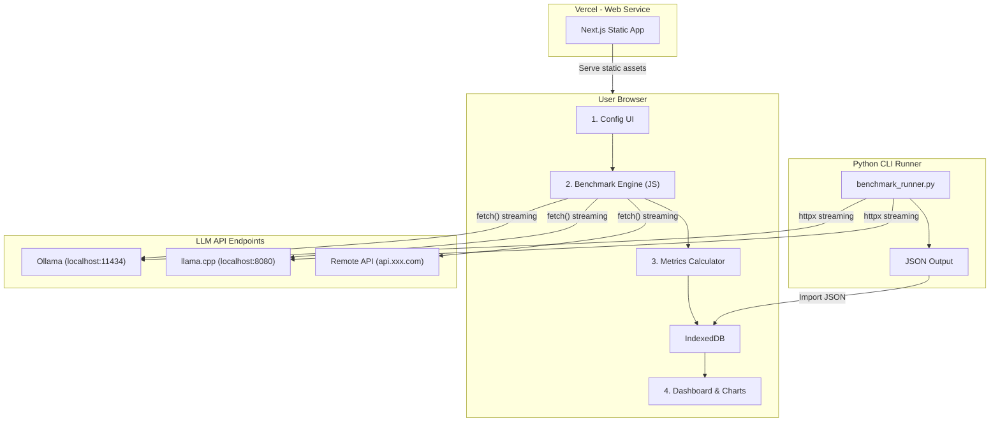

# LLM Inference Benchmark

> 一个 "LLM 测速网站" -- 类似 fast.com 测网速，但测的是 LLM API 的推理性能。

## 产品定位

面向本地/远程部署 LLM 的**轻量级推理性能测评工具**。不同于 lm-evaluation-harness 等重型评测框架，本工具：

- 用户打开网页，填入 API 地址，点击测评，看结果。**就这么简单。**
- **纯客户端执行** -- Benchmark 在浏览器中运行，Vercel 只 serve 静态页面
- **无需服务端存储** -- 所有数据留在用户浏览器 IndexedDB 中，不上传任何信息
- **无需安装任何东西** -- 浏览器即工具
- 不评测模型"答得对不对"，只评测"跑得快不快、稳不稳"

对于浏览器无法触达的场景（CORS 未配置、无头服务器等），提供 **Python CLI Runner** 作为补充，输出格式与 Web 端兼容，可导入网页查看可视化结果。

---

## 指标体系

采用四层递进设计：原始采集 -> 统计聚合 -> 并发压测 -> 综合评分。

### Layer 1: 单次请求原始采集

一次 streaming 请求的时间轴：

```
|--- TTFT ---|--- token 1 ---|--- token 2 ---|--- ... ---|--- token N ---|
^            ^               ^                            ^               ^
requestStart firstToken      token[1]                     token[N-1]      requestEnd
```

采集的原始数据：

- `requestStart` -- 发出请求的时刻
- `tokenTimestamps[]` -- 每个 token 到达的时刻数组
- `requestEnd` -- 流结束的时刻
- `outputTokenCount` -- 输出 token 总数
- `status` -- 成功/失败/超时

派生的四个单次指标：

| 指标 | 公式 | 含义 |
|------|------|------|
| **TTFT** (Time to First Token) | `tokenTimestamps[0] - requestStart` (ms) | 用户等多久才看到第一个字 |
| **TPS** (Tokens Per Second) | `outputTokenCount / (requestEnd - tokenTimestamps[0])` | 生成速度（decode 阶段） |
| **ITL** (Inter-Token Latency) | `tokenTimestamps[i+1] - tokenTimestamps[i]` 的数组 (ms) | 每两个 token 之间的间隔 |
| **E2E Latency** | `requestEnd - requestStart` (ms) | 从问到答完的总时间 |

> **设计要点**：TPS 分母用 `requestEnd - firstToken` 而非 `requestEnd - requestStart`。
> TTFT 包含 prompt 处理（prefill）时间，混进吞吐计算会低估真实 decode 速度。
> TTFT 和 TPS 必须是**正交的两个维度** -- 一个衡量 prefill，一个衡量 decode。

### Layer 2: 多次重复统计聚合

每个端点跑 N 次（默认 5 次），消除随机性后做统计聚合：

| 聚合方式 | 适用指标 | 为什么需要 |
|---------|---------|-----------|
| **Mean（均值）** | TTFT, TPS, E2E | 整体水平 |
| **P50（中位数）** | TTFT, TPS, E2E | 典型表现，不受极端值干扰 |
| **P95** | TTFT, ITL, E2E | "大多数时候"的最差表现 |
| **P99** | TTFT, ITL, E2E | 尾部延迟，暴露极端抖动 |
| **Std Dev（标准差）** | TTFT, TPS | 稳定性，方差大说明"时好时坏" |
| **Min / Max** | 所有指标 | 最好/最差情况的边界 |
| **成功率** | -- | 成功请求数 / 总请求数 (%) |

> **ITL 聚合规则**：每次请求产生一个 ITL 数组（输出 100 token 就有 99 个 ITL 值），
> N 次请求的所有 ITL 样本合并后再取 P50/P95/P99。
> 这样 ITL P95 反映的是"在所有输出的 token 中，95% 的 token 间隔在多少 ms 以内"。

### Layer 3: 并发压测指标

单并发测"一个人用的体验"，并发测"多人同时用会怎样"。对每个并发级别（1 / 2 / 4 / 8）：

| 指标 | 公式 | 含义 |
|------|------|------|
| **Request Throughput** | `完成请求数 / 墙钟时间` (req/s) | 系统每秒处理的请求数 |
| **Token Throughput** | `所有请求输出 token 总和 / 墙钟时间` (tokens/s) | 系统每秒产出的 token 数 |
| **TTFT@concurrency=N** | N 并发请求的 TTFT 均值 | 首字延迟在压力下恶化多少 |
| **TPS@concurrency=N** | N 并发请求的 TPS 均值 | 单请求速度在压力下降多少 |

核心价值：绘制**退化曲线**（X=并发数，Y=TTFT 或 TPS），斜率反映模型服务在压力下的扩展能力。

### Layer 4: 综合评分（雷达图，0-100 分）

将上述指标归一化为五维评分，让非技术用户也能一目了然：

| 维度 | 数据来源 | 评分逻辑 |
|------|---------|---------|
| **Speed（生成速度）** | TPS P50 | 越高越好，线性映射到 0-100 |
| **Responsiveness（响应灵敏）** | TTFT P50 | 越低越好，<100ms 满分，>2000ms 零分 |
| **Smoothness（输出流畅）** | ITL P95 | 越低越好，P95<20ms 满分，>200ms 零分 |
| **Scalability（并发扩展）** | 并发8 TPS / 并发1 TPS | 比值越接近 1 越好 |
| **Stability（稳定性）** | TTFT 变异系数 CV=StdDev/Mean | CV 越小越稳定 |

评分阈值参考 Apple Silicon M1-M4 系列芯片实测范围，定义为可配置常量。

---

## 技术架构

### 总体架构



### 关键架构决策

**Benchmark 执行在浏览器端（client-side）**：
- 浏览器通过 `fetch()` + `ReadableStream` 直接请求用户填入的 API 地址
- 对于 localhost 端点：主流推理框架（Ollama, llama.cpp, vLLM, MLX）均支持 CORS 配置
- 对于公网 API：浏览器可直接访问
- 使用 `performance.now()` 计时，精度在毫秒级，对 LLM 延迟测量完全足够

**零服务端状态**：
- Vercel 只负责 serve 静态页面，不做任何计算或存储
- 所有结果存在浏览器 IndexedDB，刷新不丢失
- 用户隐私完全保护 -- API Key 等敏感信息不离开浏览器

**Python Runner 作为补充**：
- 独立的 Python 脚本，不依赖 Web 服务
- 输出标准 JSON 格式，可拖拽导入 Web 页面查看图表
- 适用于：CORS 无法配置、无头服务器 SSH 环境、CI/CD 集成

### 技术栈

**Web 端：**
- Next.js 15（App Router, TypeScript）
- Tailwind CSS v4 + shadcn/ui
- Recharts（图表）
- IndexedDB via idb（本地存储）
- Vercel（部署）

**Python Runner：**
- httpx（异步流式 HTTP）
- asyncio（并发）
- rich（终端美化）

---

## 页面设计

整个 Web 应用是单页面应用（SPA），通过状态切换展示不同阶段：

### 主页 (`/`)

分为两个 Tab：

**Tab 1 -- 新建测评**

- 模型端点配置区域（支持添加多个端点）：
  - 显示名称、Base URL、API Key（可选）、Model ID
  - 快速预设按钮：Ollama / llama.cpp / vLLM / MLX 一键填入默认值
  - "检测连通性" 按钮 -- 发一个简单请求验证 API 可达 + CORS 正常
- 测评参数配置区域：
  - 测试 Prompt（内置短/中/长三档 + 自定义输入）
  - 最大输出 token 数（默认 256）
  - 每个端点重复次数（默认 5）
  - 并发级别（1 / 2 / 4 / 8）
- "开始测评" 按钮

**Tab 2 -- 历史记录**

- IndexedDB 中存储的历史测评结果列表
- 支持查看、删除、导出 JSON
- 支持从 JSON 文件导入（包括 Python Runner 的输出）

### 测评进行中（覆盖层/Modal）

- 整体进度条（已完成 / 总任务数）
- 当前正在测试的模型名称 + 轮次
- 已完成项的实时指标预览（TTFT / TPS 数字跳动）
- "取消测评" 按钮

### 测评结果

- 综合评分雷达图（五维一目了然）
- 各指标详细对比图表：
  - TTFT 对比（柱状图 + 误差线）
  - TPS 对比（柱状图）
  - ITL 分布（箱线图）
  - 并发吞吐曲线（折线图，X轴为并发数）
  - 延迟分位数阶梯图（P50 / P95 / P99）
- 原始数据表格
- 操作：导出 JSON / 保存到历史

### 当前实现状态

已实现：

- Web 端端点配置、预设、连通性检测和模型发现（通过 `/v1/models`）
- 浏览器内流式 Benchmark、重复测量、并发测量、取消测评
- TTFT / TPS / ITL / E2E / 成功率统计，以及雷达图综合评分
- TTFT、TPS、ITL 分布、并发退化曲线和原始摘要表
- IndexedDB 历史保存、删除、查看、JSON 导入/导出
- Python CLI Runner 输出 Web 端兼容 JSON
- Raw Data 表格动态颜色高亮（性能色彩编码，最优绿色/最差红色）
- CSV 导出（端点摘要 + 并发数据）
- Markdown 性能报告自动生成（含 IQR、雷达评分、并发扩展）
- 流式输出细节指标采集（Avg Chars/Chunk、Avg Chunk Interval）
- TTFT 延迟分位数阶梯图（P50/P75/P90/P95/P99 多端点叠加）
- 历史 Session 对比（勾选 2-4 个 Session 侧对比，含对比图表和明细表）

仍未实现或需后续增强：

- 原始逐请求明细表尚未展开，当前展示端点级摘要
- 浏览器端仍依赖目标服务开启 CORS；无法开启时应使用 Python Runner
- 性能趋势折线图（选定端点的历史 TTFT/TPS 时间趋势）
- 结果快照分享（URL Fragment 压缩分享）
- Prompt 长度 vs 延迟散点图
- 并发压测热力图
- 跨模型精准 Token 计数

---

## 项目结构

```
benchmark-for-LLM/
├── src/
│   ├── app/
│   │   ├── page.tsx                    # 主页（唯一页面）
│   │   ├── layout.tsx                  # Root Layout（展示 Git 版本号）
│   │   └── globals.css                 # 全局样式
│   ├── lib/
│   │   ├── benchmark/
│   │   │   ├── runner.ts               # 核心：单次流式请求 + 逐 token 计时
│   │   │   ├── orchestrator.ts         # 编排：多端点、多轮、多并发调度
│   │   │   ├── metrics.ts              # 指标聚合（P50/P75/P90/P95/P99, TPS, ITL, 流式细节）
│   │   │   ├── sse-parser.ts           # SSE 流解析器
│   │   │   ├── scoring.ts              # 综合评分（五维雷达图，阈值可配）
│   │   │   └── types.ts                # TypeScript 类型定义
│   │   ├── export-csv.ts               # CSV 导出
│   │   ├── report.ts                   # Markdown 性能报告生成
│   │   ├── prompts.ts                  # 内置测试 Prompt 集
│   │   └── store.ts                    # IndexedDB 存取封装
│   └── components/
│       ├── ui/                          # shadcn/ui 基础组件
│       ├── endpoint-config.tsx          # 端点配置卡片
│       ├── benchmark-settings.tsx       # 测评参数面板
│       ├── run-progress.tsx             # 测评进度 Modal
│       ├── result-dashboard.tsx         # 结果总览
│       ├── raw-data-table.tsx           # 动态颜色高亮数据表
│       ├── chart-ttft.tsx               # TTFT 对比图
│       ├── chart-tps.tsx                # TPS 对比图
│       ├── chart-itl.tsx                # ITL 分布图
│       ├── chart-percentile.tsx         # 延迟分位数阶梯图
│       ├── chart-throughput.tsx         # 并发吞吐曲线
│       ├── chart-radar.tsx              # 雷达图
│       ├── compare-view.tsx             # 历史 Session 对比视图
│       └── history-list.tsx             # 历史记录与 JSON 导入/导出
├── runner/
│   ├── benchmark_runner.py             # Python CLI Runner 主入口
│   ├── requirements.txt                # httpx, rich
│   └── README.md                       # Runner 使用说明
├── public/
├── package.json
├── tsconfig.json
├── next.config.ts
├── postcss.config.mjs
└── README.md
```

---

## 核心测量逻辑

### Web 端 (TypeScript)

```typescript
async function runSingleBenchmark(endpoint, prompt, maxTokens): Promise<RawResult> {
  const tokenTimestamps: number[] = [];
  const requestStart = performance.now();

  const response = await fetch(`${endpoint.baseUrl}/v1/chat/completions`, {
    method: 'POST',
    headers: {
      'Content-Type': 'application/json',
      ...(endpoint.apiKey && { 'Authorization': `Bearer ${endpoint.apiKey}` }),
    },
    body: JSON.stringify({
      model: endpoint.modelId,
      messages: [{ role: 'user', content: prompt }],
      max_tokens: maxTokens,
      stream: true,
    }),
  });

  const reader = response.body.getReader();
  for await (const token of parseSSEStream(reader)) {
    tokenTimestamps.push(performance.now());
  }

  return { requestStart, tokenTimestamps, totalTokens: tokenTimestamps.length };
}
```

### Python Runner

```python
async def run_single_benchmark(endpoint, prompt, max_tokens) -> RawResult:
    token_timestamps = []
    request_start = time.perf_counter()

    async with httpx.AsyncClient() as client:
        async with client.stream("POST", f"{endpoint.base_url}/v1/chat/completions",
            json={
                "model": endpoint.model_id,
                "messages": [{"role": "user", "content": prompt}],
                "max_tokens": max_tokens,
                "stream": True,
            },
            headers={"Authorization": f"Bearer {endpoint.api_key}"} if endpoint.api_key else {},
        ) as response:
            async for line in response.aiter_lines():
                if line.startswith("data: ") and line != "data: [DONE]":
                    chunk = json.loads(line[6:])
                    if chunk["choices"][0].get("delta", {}).get("content"):
                        token_timestamps.append(time.perf_counter())

    return RawResult(request_start=request_start, token_timestamps=token_timestamps)
```

---

## CORS 配置指南

Web 端直接从浏览器请求本地 API，需要模型服务端配置 CORS：

| 框架 | 配置方式 |
|------|---------|
| **Ollama** | `OLLAMA_ORIGINS="*" ollama serve`（v0.1.29+ 默认允许本地） |
| **llama.cpp server** | `./server --cors-allow-origin "*"` |
| **vLLM** | `vllm serve --cors-allow-origins "*"` |
| **MLX LM** | `mlx_lm.server --cors` |

如果无法配置 CORS，使用 Python Runner 代替。

---

## 改动量估计

| 模块 | 文件数 | 代码量 |
|------|--------|--------|
| Web 项目脚手架 | ~5 | 配置文件 |
| Benchmark 引擎（runner + orchestrator + metrics + sse-parser + scoring + types） | 6 | ~400 行 |
| 存储层 + 工具函数 | 3 | ~100 行 |
| 页面 + 组件 | 13 | ~800 行 |
| Python Runner | 2 | ~250 行 |
| **总计** | **~25** | **~1550 行** |
