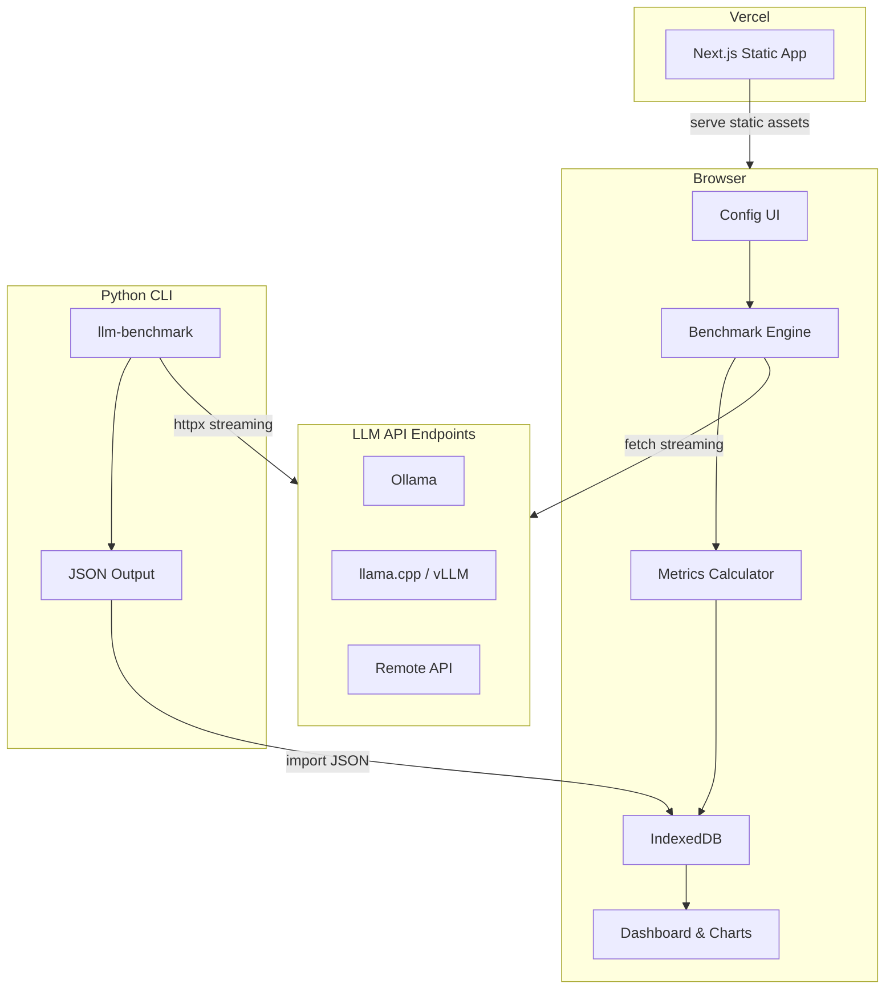
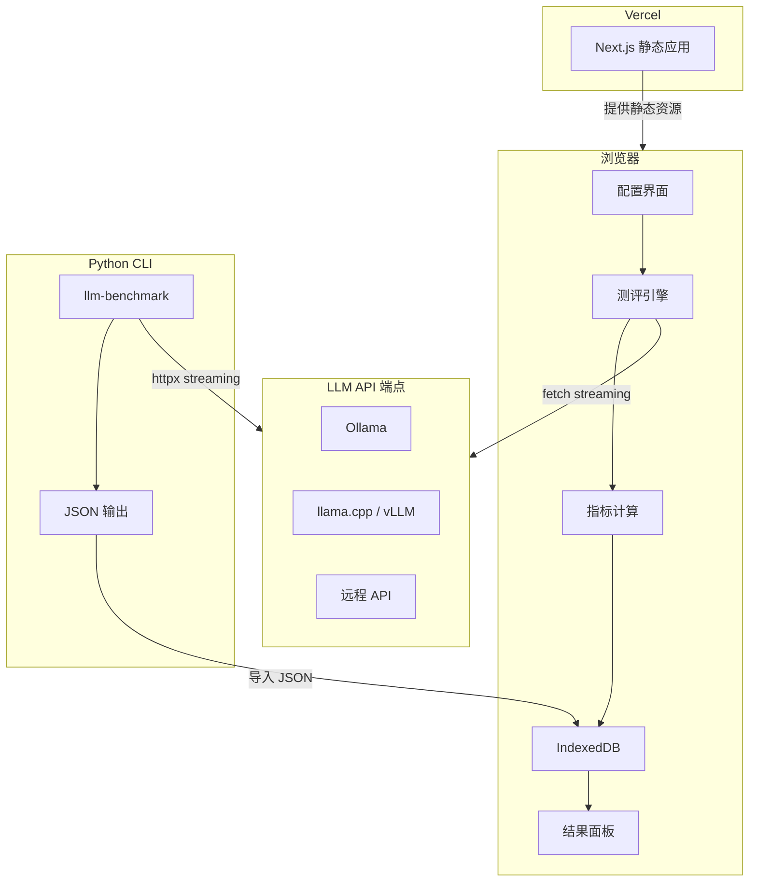

<p align="center">
  <h1 align="center">LLM Inference Benchmark</h1>
  <p align="center">
    <strong>fast.com for LLM inference</strong> — measure how fast your LLM API really is
  </p>
</p>

<p align="center">
  <a href="https://benchmark-for-llm.kuhung.me"></a>
  <a href="https://pypi.org/project/llm-benchmark-runner/"></a>
</p>

<p align="center">
  <a href="https://github.com/kuhung/benchmark-for-LLM/blob/main/LICENSE"></a>
  <a href="https://pypi.org/project/llm-benchmark-runner/"></a>
  <a href="https://github.com/kuhung/benchmark-for-LLM/stargazers"></a>
</p>

<p align="center">
  <a href="#quick-start">Quick Start</a> &bull;
  <a href="#features">Features</a> &bull;
  <a href="#python-cli">Python CLI</a> &bull;
  <a href="#metrics">Metrics</a> &bull;
  <a href="#roadmap">Roadmap</a> &bull;
  <a href="#readme-cn">中文文档</a>
</p>

---

## Why LLM Inference Benchmark?

You can check your internet speed on [fast.com](https://fast.com) in seconds. **Why can't you do the same for your LLM API?**

LLM Inference Benchmark is a lightweight inference performance testing tool for local and remote LLM deployments. Unlike heavy evaluation frameworks (lm-evaluation-harness, etc.), it doesn't care *what* your model says — only *how fast and stable* it says it.

- **Zero install** — open the [web app](https://benchmark-for-llm.kuhung.me), paste your API endpoint, click "Run". Done.
- **Privacy first** — benchmarks run entirely in your browser. API keys never leave your machine.
- **Universal** — works with any OpenAI-compatible API: Ollama, vLLM, llama.cpp, LM Studio, MLX, remote APIs, and more.
- **CLI companion** — for headless servers and CI/CD, `pip install llm-benchmark-runner` gives you the same metrics from the terminal, with JSON output importable into the web dashboard.

## Quick Start

### Web (recommended)

1. Open **[benchmark-for-llm.kuhung.me](https://benchmark-for-llm.kuhung.me)**
2. Add your endpoint (auto-discovers local Ollama / LM Studio if running)
3. Click **Start Benchmark**
4. View results: radar score, charts, and raw data

### Python CLI

```bash
pip install llm-benchmark-runner

# Benchmark a local Ollama model
llm-benchmark --url http://localhost:11434 --model llama3.2

# Remote API with key
llm-benchmark --url https://api.example.com --model gpt-4 --api-key sk-xxx

# Full options
llm-benchmark \
  --url http://localhost:11434 \
  --model llama3.2 \
  --repeat 10 \
  --concurrency 1,2,4,8 \
  --output results.json
```

Import the output JSON into the web dashboard to visualize charts and radar scores.

## Features

### Benchmark Engine

| Capability | Web | CLI |
|---|:---:|:---:|
| TTFT / TPS / ITL / E2E latency measurement | Yes | Yes |
| Statistical aggregation (P50/P75/P90/P95/P99) | Yes | Yes |
| Multi-concurrency stress test (1/2/4/8) | Yes | Yes |
| Five-dimension radar score (0-100) | Yes | Yes |
| Streaming chunk analysis | Yes | Yes |
| Cold-start TTFT detection | Yes | - |
| Thinking mode support | Yes | - |

### Visualization & Data

- Radar chart — five-dimension overall score at a glance
- TTFT / TPS comparison bar charts with error bars
- ITL distribution (P50/P95/P99 grouped bars)
- Concurrency degradation curves (TPS/TTFT vs concurrency)
- Latency percentile ladder chart (P50 through P99)
- Raw data table with performance color coding (green-to-red gradient)
- Historical session comparison (2-4 sessions side by side)
- Export: JSON / CSV / Markdown report

### UX

- Auto-discovery of local LLM services (Ollama, LM Studio, oMLX)
- Built-in presets for common frameworks
- Connectivity check before benchmarking
- Model picker via `/v1/models` API
- Dark / Light theme
- English / Chinese bilingual UI
- IndexedDB persistence — refresh won't lose your data

## Metrics

A four-layer progressive metric system: Raw Capture -> Statistical Aggregation -> Concurrency Stress -> Composite Score.

### Layer 1 — Per-Request Raw Metrics

```
|--- TTFT ---|--- token 1 ---|--- token 2 ---|--- ... ---|--- token N ---|
^            ^               ^                            ^               ^
requestStart firstToken      token[1]                     token[N-1]      requestEnd
```

| Metric | Formula | Meaning |
|---|---|---|
| **TTFT** | `firstToken - requestStart` (ms) | Time to first token — prefill latency |
| **TPS** | `tokenCount / (requestEnd - firstToken)` | Tokens per second — decode throughput |
| **ITL** | `token[i+1] - token[i]` array (ms) | Inter-token latency — output smoothness |
| **E2E** | `requestEnd - requestStart` (ms) | End-to-end total latency |

> TPS denominator uses `requestEnd - firstToken` (not `requestStart`). TTFT and TPS are orthogonal: one measures prefill, the other measures decode.

### Layer 2 — Statistical Aggregation

Each endpoint runs N times (default 5). Aggregated stats: Mean, P50, P75, P90, P95, P99, Min, Max, Std Dev, Success Rate.

### Layer 3 — Concurrency Stress

For each concurrency level (1 / 2 / 4 / 8):
- **Request Throughput** (req/s) and **Token Throughput** (tokens/s)
- TTFT and TPS degradation under load

### Layer 4 — Composite Radar Score (0-100)

| Dimension | Source | Logic |
|---|---|---|
| **Speed** | TPS P50 | Higher is better |
| **Responsiveness** | TTFT P50 | Lower is better (<100ms = 100, >2000ms = 0) |
| **Smoothness** | ITL P95 | Lower is better (<20ms = 100, >200ms = 0) |
| **Scalability** | TPS@C8 / TPS@C1 | Closer to 1.0 is better |
| **Consistency** | TTFT CV (StdDev/Mean) | Lower is better |

## Architecture



**Key decisions:**
- Benchmarks execute client-side via `fetch()` + `ReadableStream` — zero server cost, total privacy
- Vercel only serves static assets — no backend, no database, no tracking
- Python CLI shares the same `BenchmarkSession` JSON schema — CLI results visualize in the web dashboard

### Tech Stack

**Web:** Next.js 15 (App Router) / React 19 / TypeScript / Tailwind CSS v4 / shadcn/ui / Recharts / IndexedDB

**CLI:** Python 3.10+ / httpx / asyncio / Rich

## CORS Configuration

The web app makes requests directly from the browser. Local LLM services need CORS enabled:

| Framework | Command |
|---|---|
| **Ollama** | `OLLAMA_ORIGINS="*" ollama serve` |
| **llama.cpp** | `./server --cors-allow-origin "*"` |
| **vLLM** | `vllm serve --cors-allow-origins "*"` |
| **MLX LM** | `mlx_lm.server --cors` |

If CORS isn't an option, use the Python CLI instead.

## Roadmap

Development is actively ongoing. The next iteration focuses on enhancing the **Python CLI package**:

### In Progress

- [ ] **CLI Multi-language Support** — English-first output with Chinese locale ([#16](https://github.com/kuhung/benchmark-for-LLM/issues/16))
- [ ] **Model Discovery & Interactive Config** — auto-detect available models, interactive endpoint setup in CLI ([#17](https://github.com/kuhung/benchmark-for-LLM/issues/17))
- [ ] **Performance Monitoring** — real-time performance metrics dashboard in terminal, resource usage tracking ([#18](https://github.com/kuhung/benchmark-for-LLM/issues/18))

### Planned

- [ ] **Token Segmentation & Statistics** — accurate cross-model token counting and chunk analysis ([#7](https://github.com/kuhung/benchmark-for-LLM/issues/7))
- [ ] **Ollama Native API** — support Ollama's native `/api/generate` alongside OpenAI-compatible endpoint ([#10](https://github.com/kuhung/benchmark-for-LLM/issues/10))
- [ ] **UX Refinements** — streamline endpoint addition flow ([#12](https://github.com/kuhung/benchmark-for-LLM/issues/12))
- [ ] **Competitive Comparison** — benchmark comparison against public leaderboard data ([#15](https://github.com/kuhung/benchmark-for-LLM/issues/15))

### Future

- [ ] Performance trend charts (historical TTFT/TPS over time)
- [ ] Result snapshot sharing (URL fragment compression)
- [ ] Prompt length vs latency scatter plot
- [ ] Concurrency heatmap
- [ ] Per-request detail drill-down table

## Contributing

Contributions are welcome! Whether it's a bug report, feature request, or pull request — every bit helps.

```bash
# Web development
npm install && npm run dev

# Python CLI development
cd runner && pip install -e .
```

## License

[MIT](./LICENSE)

---

<a id="readme-cn"></a>

<p align="center">
  <h1 align="center">LLM Inference Benchmark</h1>
  <p align="center">
    <strong>LLM 推理测速工具</strong> — 像 fast.com 测网速一样，测你的 LLM API 到底有多快
  </p>
</p>

<p align="center">
  <a href="https://benchmark-for-llm.kuhung.me"></a>
  <a href="https://pypi.org/project/llm-benchmark-runner/"></a>
</p>

<p align="center">
  <a href="#快速开始">快速开始</a> &bull;
  <a href="#核心功能">核心功能</a> &bull;
  <a href="#python-命令行">Python 命令行</a> &bull;
  <a href="#指标体系">指标体系</a> &bull;
  <a href="#路线图">路线图</a> &bull;
  <a href="#why-llm-benchmark">English</a>
</p>

---

## 为什么需要 LLM Inference Benchmark?

[fast.com](https://fast.com) 让你几秒钟就能测网速。**为什么 LLM API 不能这样测？**

LLM Inference Benchmark 是一个面向本地/远程 LLM 部署的轻量级推理性能测评工具。不同于 lm-evaluation-harness 等重型评测框架，它不关心模型"答得对不对"，只关心"跑得快不快、稳不稳"。

- **零安装** — 打开[网页](https://benchmark-for-llm.kuhung.me)，填入 API 地址，点击测评，看结果。就这么简单。
- **隐私安全** — Benchmark 在浏览器中运行，API Key 等敏感信息不离开你的设备。
- **广泛兼容** — 支持所有 OpenAI 兼容 API：Ollama、vLLM、llama.cpp、LM Studio、MLX 等。
- **CLI 补充** — 对于无头服务器和 CI/CD 场景，`pip install llm-benchmark-runner` 提供相同的指标采集能力，JSON 输出可导入网页端查看图表。

## 快速开始

### 网页端（推荐）

1. 打开 **[benchmark-for-llm.kuhung.me](https://benchmark-for-llm.kuhung.me)**
2. 添加端点（会自动发现本地运行的 Ollama / LM Studio）
3. 点击 **开始测评**
4. 查看结果：雷达评分、图表、原始数据

### Python 命令行

```bash
pip install llm-benchmark-runner

# 测试本地 Ollama
llm-benchmark --url http://localhost:11434 --model llama3.2

# 测试远程 API
llm-benchmark --url https://api.example.com --model gpt-4 --api-key sk-xxx

# 完整参数
llm-benchmark \
  --url http://localhost:11434 \
  --model llama3.2 \
  --repeat 10 \
  --concurrency 1,2,4,8 \
  --output results.json
```

CLI 输出的 JSON 文件可直接导入网页端查看可视化图表和雷达评分。

## 核心功能

### 测评引擎

| 能力 | 网页端 | CLI |
|---|:---:|:---:|
| TTFT / TPS / ITL / E2E 延迟测量 | Yes | Yes |
| 统计聚合（P50/P75/P90/P95/P99） | Yes | Yes |
| 多并发压测（1/2/4/8） | Yes | Yes |
| 五维雷达评分（0-100） | Yes | Yes |
| 流式输出分析 | Yes | Yes |
| 冷启动 TTFT 检测 | Yes | - |
| 推理模式支持 | Yes | - |

### 可视化与数据

- 雷达图 — 五维综合评分一目了然
- TTFT / TPS 对比柱状图（含误差线）
- ITL 分布图（P50/P95/P99 分组）
- 并发退化曲线（TPS/TTFT vs 并发数）
- 延迟分位数阶梯图（P50 到 P99）
- 原始数据表（性能色彩编码：绿色最优 / 红色最差）
- 历史 Session 对比（2-4 个 Session 侧对比）
- 导出：JSON / CSV / Markdown 报告

### 用户体验

- 自动发现本地 LLM 服务（Ollama、LM Studio、oMLX）
- 内置常用框架预设
- 连通性检测
- `/v1/models` 模型选择器
- 深色 / 浅色主题
- 中英双语界面
- IndexedDB 持久化 — 刷新页面不丢数据

## 指标体系

四层递进设计：原始采集 -> 统计聚合 -> 并发压测 -> 综合评分。

### 第一层 — 单次请求原始指标

```
|--- TTFT ---|--- token 1 ---|--- token 2 ---|--- ... ---|--- token N ---|
^            ^               ^                            ^               ^
requestStart firstToken      token[1]                     token[N-1]      requestEnd
```

| 指标 | 公式 | 含义 |
|---|---|---|
| **TTFT** | `firstToken - requestStart` (ms) | 首字延迟 — 用户等多久看到第一个字 |
| **TPS** | `tokenCount / (requestEnd - firstToken)` | 生成速度 — decode 阶段吞吐 |
| **ITL** | `token[i+1] - token[i]` 数组 (ms) | 字间延迟 — 输出流畅度 |
| **E2E** | `requestEnd - requestStart` (ms) | 端到端总延迟 |

> TPS 分母用 `requestEnd - firstToken`，不含 prefill 时间。TTFT 和 TPS 保持正交：一个衡量 prefill，一个衡量 decode。

### 第二层 — 统计聚合

每个端点跑 N 次（默认 5），聚合统计：Mean、P50、P75、P90、P95、P99、Min、Max、Std Dev、成功率。

### 第三层 — 并发压测

每个并发级别（1 / 2 / 4 / 8）下的：
- **请求吞吐** (req/s) 和 **Token 吞吐** (tokens/s)
- TTFT 和 TPS 在压力下的退化情况

### 第四层 — 综合雷达评分（0-100）

| 维度 | 数据来源 | 评分逻辑 |
|---|---|---|
| **速度** | TPS P50 | 越高越好 |
| **响应灵敏** | TTFT P50 | 越低越好（<100ms 满分，>2000ms 零分） |
| **输出流畅** | ITL P95 | 越低越好（<20ms 满分，>200ms 零分） |
| **并发扩展** | TPS@C8 / TPS@C1 | 比值越接近 1.0 越好 |
| **一致性** | TTFT 变异系数 | 越低越好 |

## 技术架构



**核心设计决策：**
- 浏览器端执行测评（`fetch()` + `ReadableStream`）— 零服务端成本，完全隐私
- Vercel 只 serve 静态页面 — 无后端、无数据库、无追踪
- Python CLI 与 Web 端共享 `BenchmarkSession` JSON 格式 — CLI 结果可直接在网页端可视化

### 技术栈

**Web 端：** Next.js 15 (App Router) / React 19 / TypeScript / Tailwind CSS v4 / shadcn/ui / Recharts / IndexedDB

**CLI：** Python 3.10+ / httpx / asyncio / Rich

## CORS 配置

网页端直接从浏览器请求 API，本地 LLM 服务需启用 CORS：

| 框架 | 启动命令 |
|---|---|
| **Ollama** | `OLLAMA_ORIGINS="*" ollama serve` |
| **llama.cpp** | `./server --cors-allow-origin "*"` |
| **vLLM** | `vllm serve --cors-allow-origins "*"` |
| **MLX LM** | `mlx_lm.server --cors` |

无法配置 CORS 时，使用 Python CLI 代替。

## 路线图

项目正在活跃迭代中。下一阶段聚焦于增强 **Python CLI 包**：

### 进行中

- [ ] **CLI 多语言支持** — 英文优先输出，支持中文语区 ([#16](https://github.com/kuhung/benchmark-for-LLM/issues/16))
- [ ] **模型发现与交互配置** — CLI 自动检测可用模型，交互式端点配置 ([#17](https://github.com/kuhung/benchmark-for-LLM/issues/17))
- [ ] **性能参数监控** — 终端实时性能指标面板，资源使用追踪 ([#18](https://github.com/kuhung/benchmark-for-LLM/issues/18))

### 已规划

- [ ] **Token 切分与统计** — 跨模型精准 token 计数与 chunk 分析 ([#7](https://github.com/kuhung/benchmark-for-LLM/issues/7))
- [ ] **Ollama 原生接口** — 支持 Ollama `/api/generate` 原生协议 ([#10](https://github.com/kuhung/benchmark-for-LLM/issues/10))
- [ ] **交互体验优化** — 优化端点添加流程 ([#12](https://github.com/kuhung/benchmark-for-LLM/issues/12))
- [ ] **竞品对比** — 对标公开排行榜数据 ([#15](https://github.com/kuhung/benchmark-for-LLM/issues/15))

### 远期规划

- [ ] 性能趋势图（历史 TTFT/TPS 时间线）
- [ ] 结果快照分享（URL 压缩分享）
- [ ] Prompt 长度 vs 延迟散点图
- [ ] 并发压测热力图
- [ ] 逐请求明细下钻表

## 参与贡献

欢迎任何形式的贡献 — Bug 反馈、功能建议、Pull Request 都可以。

```bash
# Web 端开发
npm install && npm run dev

# Python CLI 开发
cd runner && pip install -e .
```

## 开源协议

[MIT](./LICENSE)
